# 校园快递取件优化系统 - 系统实现文档

## 5 系统实现

### 5.1 用户模块实现

#### 5.1.1 系统首页

当进入校园快递取件系统时，显示的是系统首页，顶部为自动轮播的公告提醒，中部为快递搜索框与功能入口，下方展示待取快递快捷区，如图5-1所示。

首页采用移动端优先的设计风格，整体布局简洁清爽，使用蓝色作为主色调。轮播图区域展示最新公告和取件提醒，支持自动播放和手动切换。搜索框支持按取件码或快递单号查询。功能入口区域分为"我的快递"、"取件预约"、"消息通知"三个卡片，点击可快速跳转对应页面。待取快递快捷区直接展示最近2个待取快递的取件码和存放位置，方便用户快速查看。

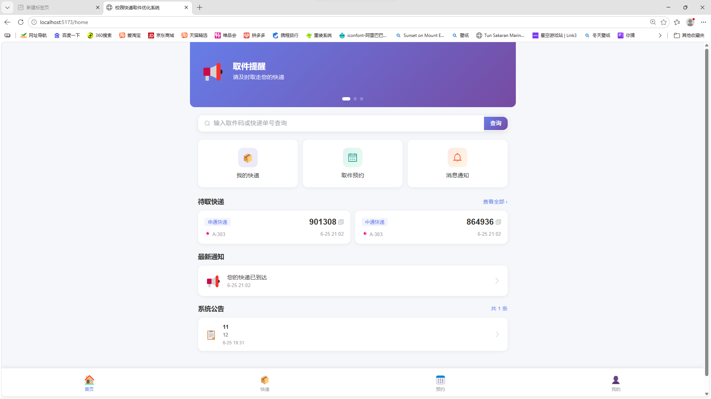

图5-1 首页

#### 5.1.2 注册登录

用户可通过手机号进行注册与登录，登录后可使用系统全部功能，如图5-2、5-3所示。

登录页面采用居中卡片式布局，包含用户名和密码输入框，支持点击忘记密码跳转至密码重置页面。注册页面要求输入姓名、学号、手机号和密码，表单带有实时验证功能。系统采用 JWT 令牌进行身份认证，登录成功后将令牌存储在本地存储中。

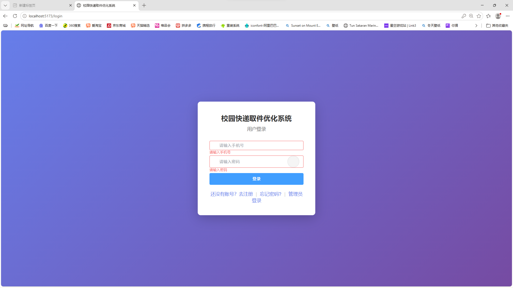

图5-2 登录

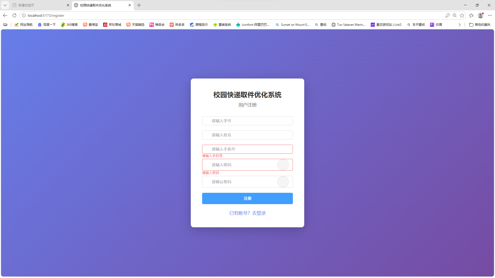

图5-3 注册

#### 5.1.3 我的快递

用户可查看所有快递记录，快递卡片突出显示取件码，支持一键复制，并用标签区分待取与已取状态，如图5-4所示。

快递列表按时间倒序排列，每张卡片展示快递公司、快递单号、取件码、存放位置和取件时间等信息。取件码以大字体高亮显示，点击即可复制到剪贴板。状态标签采用彩色区分：橙色表示待取，蓝色表示已预约，绿色表示已取。卡片支持滑动操作和点击查看详情。

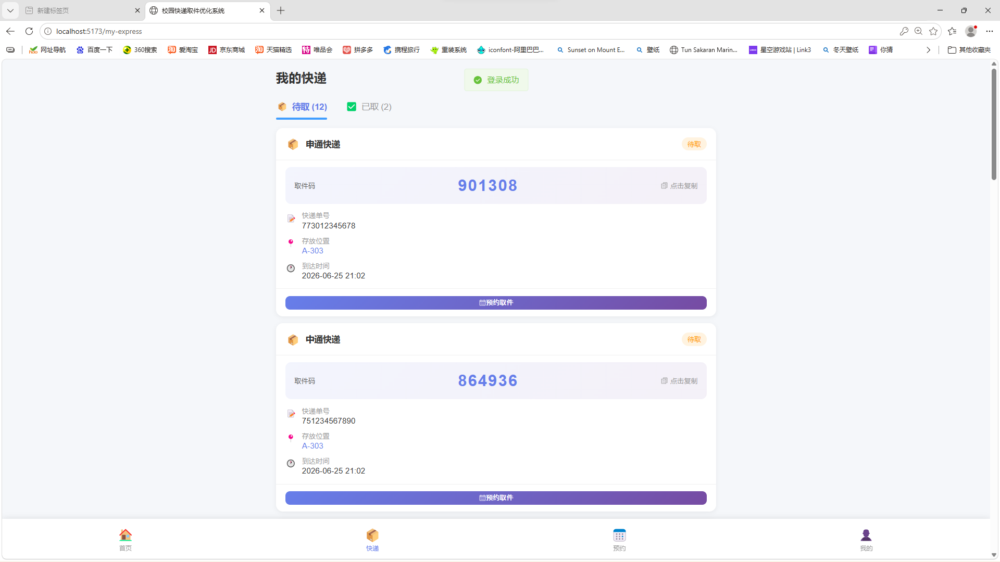

图5-4 我的快递

#### 5.1.4 取件预约

用户可选择待取快递并预约取件时间段，系统显示各时段预约人数，如图5-5所示。

预约页面展示所有待取快递列表，用户选择快递后可查看可选的预约时间段。每个时间段显示当前预约人数，帮助用户选择合适的时间。预约成功后系统会发送通知提醒用户准时取件，用户也可提前取消预约。

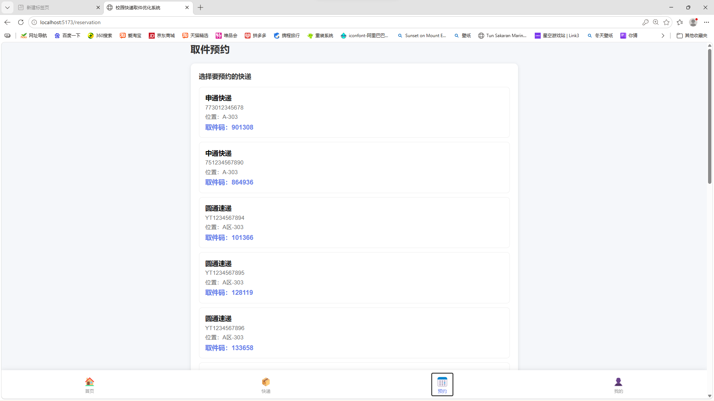

图5-5 取件预约

#### 5.1.5 消息通知

系统向用户推送快递到件、预约提醒等通知消息，支持一键标记已读，如图5-6所示。

通知列表按时间倒序排列，未读通知以蓝色圆点标记。用户可点击查看通知详情，支持单个标记已读或一键标记全部已读。通知类型包括：快递到件通知、预约成功通知、预约取消通知等。

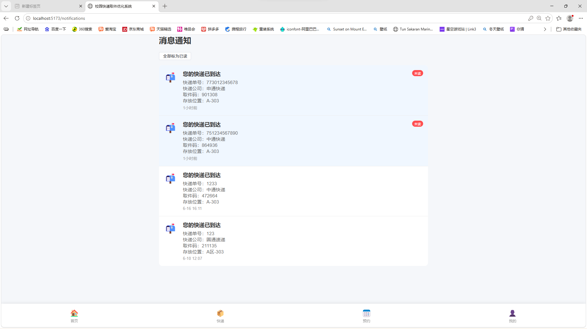

图5-6 消息通知

#### 5.1.6 系统公告

首页展示最新的系统公告，点击可查看公告详情，如图5-7、5-8所示。

系统公告模块位于首页底部，展示最近发布的公告列表，包含标题、内容预览和发布时间。点击公告可弹出详情弹窗查看完整内容。公告由管理员在后台发布和管理。

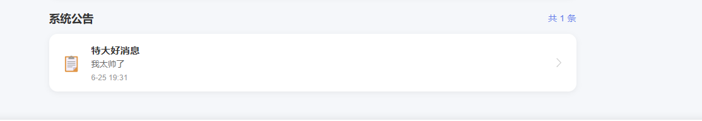

图5-7 系统公告

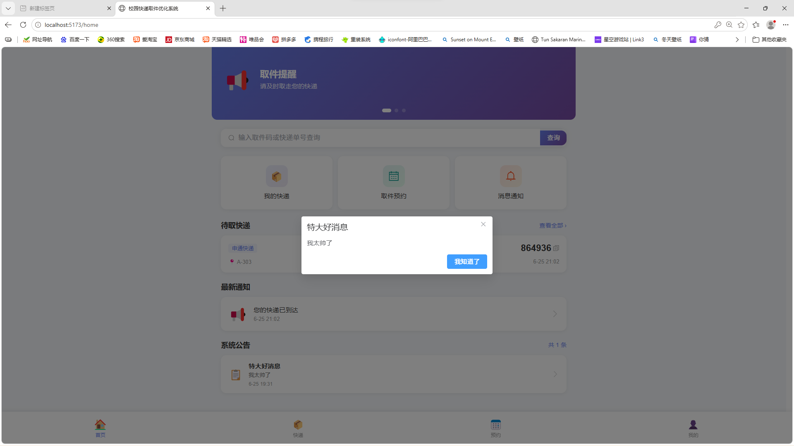

图5-8 公告详情

#### 5.1.7 个人中心

用户可查看个人信息，提供地址管理、意见反馈、帮助中心等功能入口，如图5-9所示。

个人中心页面顶部为用户信息卡片，采用渐变背景设计，显示用户头像、姓名和学号。下方功能入口包括：地址管理、意见反馈、帮助中心。帮助中心提供常见问题解答，包括取件流程、预约规则等，同时提供跳转到B站搜索取件攻略的入口。退出登录按钮位于页面底部。

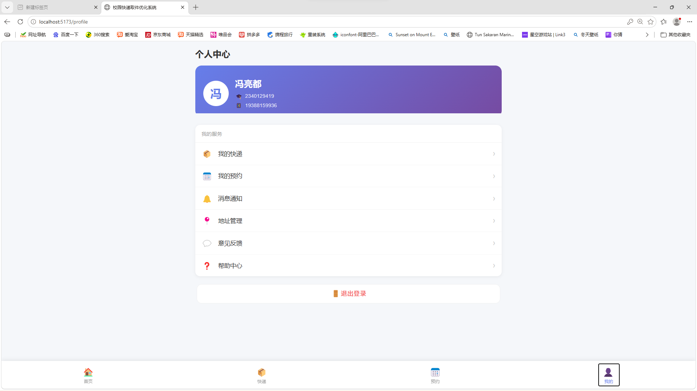

图5-9 个人中心

### 5.2 管理员模块实现

#### 5.2.1 后台首页

管理员登录后进入后台首页，显示总快递数、待取件数、已取件数、今日到件等数据统计，如图5-10所示。

后台首页采用左侧边栏布局，左侧为功能菜单，右侧为内容区域。统计卡片区域展示6个核心数据指标：总快递数、待取件数、已取件数、取件率、今日到件、今日预约。每个卡片配有图标和渐变背景，色彩区分不同数据类型。快捷操作区域提供快速入口，方便管理员执行常用操作。

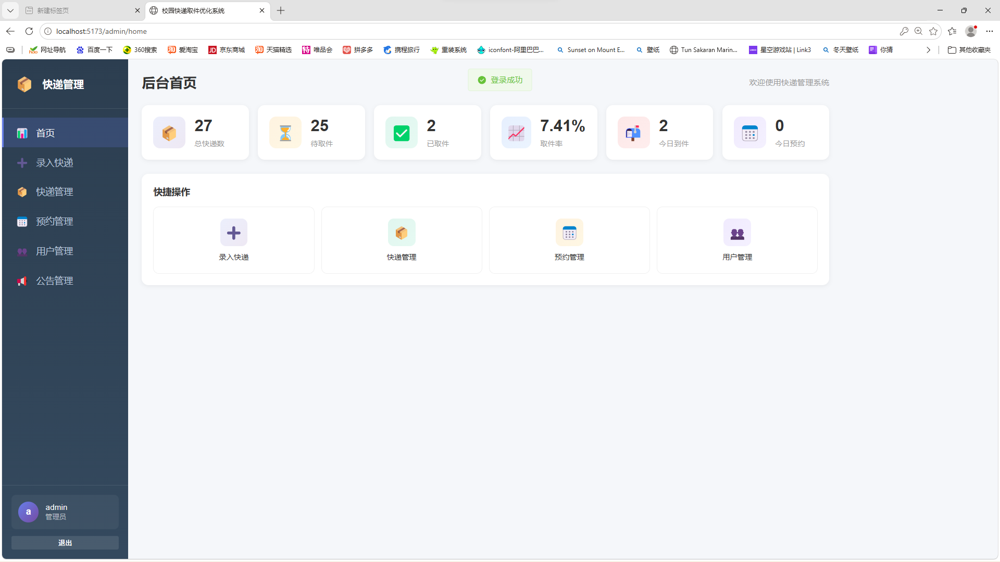

图5-10 后台首页

#### 5.2.2 录入快递

管理员可单条录入或批量导入快递信息，单条录入采用双列表单布局，批量录入支持粘贴数据，如图5-11所示。

单条录入表单采用两列布局，包含快递单号、快递公司、收件人姓名、收件人手机、存放位置等字段，每个输入框带有图标和校验提示。批量录入支持按指定格式粘贴多条数据，系统自动解析并进行格式校验，显示成功和失败的数量统计。

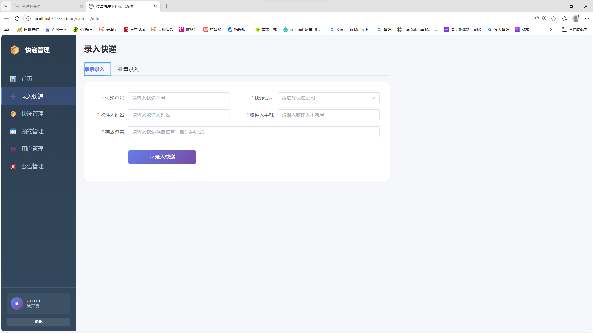

图5-11 录入快递

#### 5.2.3 快递管理

管理员可查看所有快递记录，支持按单号、状态、快递公司筛选搜索，状态以彩色标签展示，如图5-12所示。

快递管理页面顶部为完整的筛选搜索栏，支持按关键词搜索、状态筛选、快递公司筛选。表格展示快递的完整信息，状态字段采用彩色标签样式：待取为橙色、已预约为蓝色、已取为绿色。操作列提供状态修改和补发通知按钮，区分主次样式。空状态时显示插画和引导按钮。

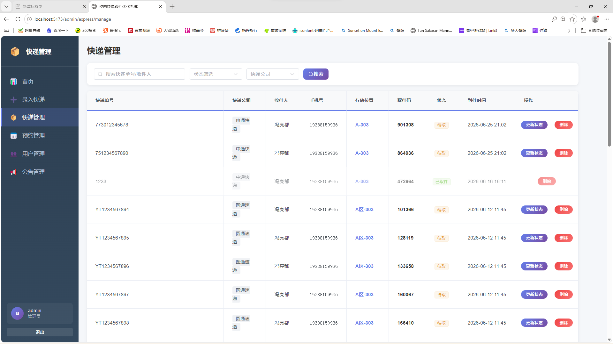

图5-12 快递管理

#### 5.2.4 预约管理

管理员可查看所有用户预约记录，支持按状态、日期筛选，可完成或取消预约，如图5-13所示。

预约管理页面顶部为筛选栏，支持按用户ID/快递ID搜索、状态筛选和日期筛选。表格展示预约的详细信息，包括用户ID、快递ID、预约日期、预约时段和状态。操作列提供完成和取消按钮，支持批量操作。状态标签采用彩色区分：待取件为橙色、已完成为绿色、已取消为灰色。

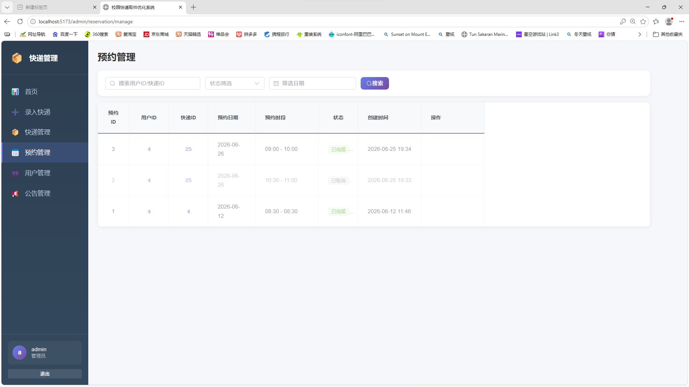

图5-13 预约管理

#### 5.2.5 用户管理

管理员可查看注册用户列表，支持按姓名、学号、手机号搜索，可进行启用/禁用和删除操作，如图5-14所示。

用户管理页面顶部为搜索筛选栏，支持按姓名、学号、手机号搜索和状态筛选。表格展示用户的详细信息，包括学号、姓名、手机号、角色和状态。状态标签采用彩色区分：启用为绿色、禁用为灰色。操作列提供启用/禁用和删除按钮，删除操作需要二次确认。

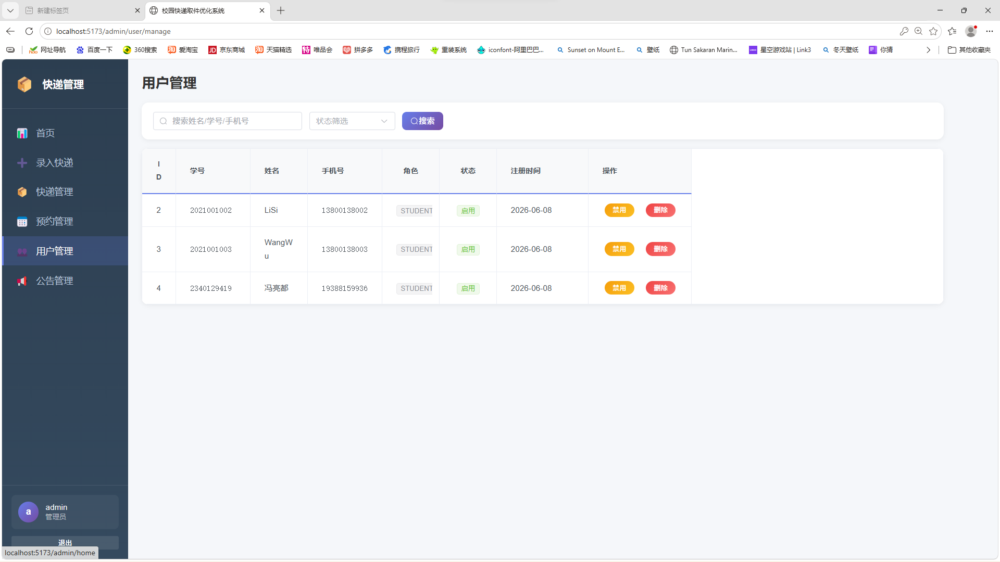

图5-14 用户管理

#### 5.2.6 公告管理

管理员可发布、编辑、删除系统公告，支持按标题搜索，如图5-15所示。

公告管理页面顶部为搜索栏和发布公告按钮。表格展示公告的完整信息，包括标题、内容预览、优先级和发布时间。优先级标签采用彩色区分：高优先级为红色、中优先级为橙色、低优先级为灰色。操作列提供编辑和删除按钮，支持发布新公告。

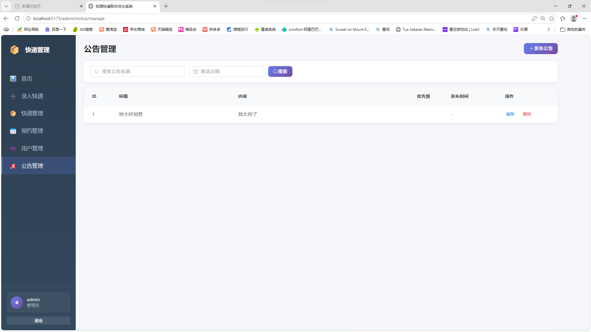

图5-15 公告管理

---

**文档版本**：V1.0  
**创建日期**：2026 年 6 月 25 日  
**团队**：极速取件小组
